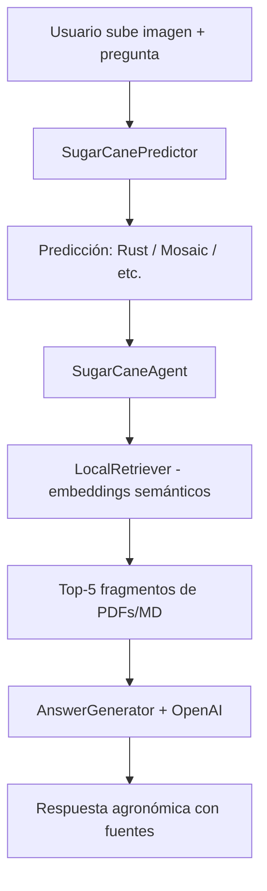

# Información del sistema RAG — SugarCane AI Agent

Documento de referencia para el proyecto de grado: arquitectura, funcionamiento y evaluación del módulo **Retrieval-Augmented Generation (RAG)** integrado con visión computacional y agente conversacional.

---

## ¿Qué es el RAG en este proyecto?

**RAG** (Retrieval-Augmented Generation) es un enfoque en el que el sistema **no responde solo con el conocimiento del LLM**: primero **recupera información real** de documentos agronómicos y después **genera una respuesta sustentada** en esos fragmentos.

En SugarCane el RAG combina tres piezas:

1. **Visión computacional** — clasifica la hoja (Rust, Mosaic, Healthy, etc.)
2. **Recuperación (R)** — busca en la base documental de caña de azúcar
3. **Generación (G)** — OpenAI (`gpt-4o-mini`) redacta la respuesta agronómica

---

## Flujo completo



### Orquestación (`src/app/agent/agent.py`)

El agente `SugarCaneAgent` coordina recuperación y generación:

1. Recibe la pregunta del usuario y la predicción de imagen (si existe).
2. Llama a `retriever.search()` → obtiene los 5 fragmentos más relevantes.
3. Llama a `generator.generate()` → produce la respuesta final.
4. Opcionalmente persiste historial y fuentes en `data/conversations/`.

---

## Etapa 1 — Base de conocimiento (ingesta)

| Aspecto | Detalle |
|---------|---------|
| **Ubicación** | `src/app/knowledge_base/` |
| **Volumen** | 46 documentos (39 PDF + 7 Markdown) |
| **Módulo** | `src/app/rag/ingestion.py` |

**Proceso:**

- Lectura de PDFs (`pypdf`) y archivos Markdown.
- Limpieza de texto y enriquecimiento de términos agronómicos (roya, MIP, NPK, etc.) vía `preprocessing.py`.
- Segmentación en **chunks** (~1400 caracteres, solapamiento ~300), respetando límites de oración cuando es posible.
- Detección de enfermedades asociadas a cada fragmento (metadatos).

**Resultado:** aproximadamente **1.923 fragmentos** indexables para búsqueda semántica.

### Markdown curados (7 archivos)

- `amarillamiento_yellow_cana.md`
- `enfermedades_cana_azucar.md`
- `hoja_sana_healthy_cana.md`
- `manejo_integrado_enfermedades_cana.md`
- `mosaico_cana.md`
- `podredumbre_roja_redrot_cana.md`
- `roya_rust_cana.md`

---

## Etapa 2 — Recuperación (Retrieval) con embeddings

| Aspecto | Detalle |
|---------|---------|
| **Método por defecto** | `semantic` (`RAG_RETRIEVAL_METHOD` en `.env`) |
| **Modelo de embeddings** | `paraphrase-multilingual-mpnet-base-v2` |
| **Índice vectorial** | FAISS (`IndexFlatIP`) |
| **Módulos** | `embeddings.py`, `retriever.py` |

**Proceso:**

1. Cada chunk se convierte en un **vector denso** (768 dimensiones).
2. Los vectores se almacenan en **FAISS** para búsqueda por similitud coseno.
3. Ante una consulta:
   - **Expansión de query** con sinónimos de enfermedades, intención (síntomas/manejo) e historial reciente.
   - Embedding de la consulta expandida.
   - Recuperación de los **top-5** fragmentos más similares.
   - **MMR** (Maximal Marginal Relevance) para diversificar fuentes.
   - **Boost por enfermedad** si coincide con la predicción del modelo de visión.

**Métodos alternativos** (experimentación): `tfidf`, `bm25`, `hybrid` (fusión RRF semantic + BM25).

---

## Etapa 3 — Generación (Generation)

| Aspecto | Detalle |
|---------|---------|
| **Módulo** | `src/app/rag/generator.py` |
| **Clase** | `AnswerGenerator` |

El generador construye un prompt con:

- Historial de conversación.
- Clasificación de imagen (clase, confianza, Grad-CAM si está disponible).
- **Evidencia RAG** (fragmentos recuperados con fuente, sección y score).
- Pregunta del usuario.

### Cadena de motores de respuesta

1. **OpenAI** (`gpt-4o-mini`) — si `OPENAI_API_KEY` está configurada en `.env`.
2. **Ollama** — respaldo local si no hay OpenAI.
3. **Fallback extractivo** — selección de oraciones relevantes sin LLM.

### Reglas del sistema (prompt agronómico)

- Responder **solo** con base en la evidencia recuperada.
- No inventar dosis, productos comerciales ni diagnósticos definitivos.
- Indicar que la predicción por imagen es **apoyo**, no confirmación de campo.
- Rechazar preguntas fuera del dominio agronómico de caña de azúcar.

---

## Integración multimodal

El RAG **no opera solo con texto**:

- Si el modelo de visión predice **Rust**, el retriever prioriza documentos sobre roya.
- El LLM relaciona síntomas y manejo con la enfermedad inferida en la imagen.
- Grad-CAM aporta contexto de explicabilidad cuando está disponible.

---

## Métricas oficiales de evaluación

| Métrica | Descripción |
|---------|-------------|
| **Faithfulness** | Proporción de la respuesta sustentada en los contextos recuperados |
| **Answer Relevance** | Alineación pregunta–respuesta (léxica + similitud semántica) |
| **nDCG@5** | Calidad del ranking de fragmentos (relevancia semántica por embeddings) |
| **Hallucination Rate** | Tasa de alucinación proxy: `1 − Faithfulness` |

### Ejecución de evaluación

```powershell
cd "C:\SugarCane ProyectoFinal\SugarCane ProyectoFinal\SugarCane ProyectoFinal"
$env:PYTHONPATH="src"
.\.venv\Scripts\python.exe src/scripts/eval_rag_ragas.py --skip-ragas
```

### Archivos de resultados

| Archivo | Contenido |
|---------|-----------|
| `data/eval/rag_eval_results.json` | Resultados completos por caso |
| `data/eval/rag_eval_results.csv` | Tabla para análisis |
| `data/eval/rag_eval_summary.txt` | Resumen legible |
| `data/eval/rag_eval_bootstrap.csv` | Intervalos de confianza 95% |
| `data/eval/rag_eval_ablation.csv` | Comparación con/sin RAG |
| `data/eval/rag_corpus_report.json` | Estadísticas del corpus |

---

## Configuración (`.env`)

```env
RAG_RETRIEVAL_METHOD=semantic
SEMANTIC_MODEL_NAME=paraphrase-multilingual-mpnet-base-v2
KNOWLEDGE_DIR=src/app/knowledge_base
OPENAI_API_KEY=sk-...
OPENAI_MODEL=gpt-4o-mini
CHUNK_SIZE_CHARS=1400
CHUNK_OVERLAP_CHARS=300
```

---

## Estructura de módulos RAG

```text
src/app/rag/
├── ingestion.py      # Carga PDF/MD, chunking, limpieza
├── preprocessing.py  # Normalización términos agronómicos
├── embeddings.py     # TF-IDF, BM25, semantic, hybrid + FAISS
├── retriever.py      # Búsqueda, MMR, boost por enfermedad
├── generator.py      # Integración LLM (OpenAI/Ollama/fallback)
├── eval_metrics.py   # Faithfulness, Answer Relevance, nDCG, Hallucination
├── compare.py        # Comparación de métodos
├── report.py         # Gráficos y tablas para tesis
└── README.md         # Documentación técnica del pipeline
```

---

## Puesta en marcha (Streamlit)

```powershell
$env:PYTHONPATH="src"
.\.venv\Scripts\streamlit.exe run src/app/ui/streamlit_app.py
```

Abrir: **http://localhost:8501**

1. Subir imagen de hoja → **Clasificar hoja** (requiere `models/best.pt`).
2. Formular pregunta agronómica en el chat.
3. Verificar en el sidebar: modelo cargado + motor OpenAI.

---

## Resumen

> El RAG de SugarCane **recupera información en 46 documentos técnicos de caña de azúcar** mediante **embeddings semánticos multilingües** indexados en FAISS, selecciona los fragmentos más relevantes según la pregunta y la enfermedad detectada por visión computacional, y **genera una respuesta agronómica fundamentada** con OpenAI a partir de esa evidencia documental.

---

## Referencias

- Lewis, P. et al. (2020). *Retrieval-Augmented Generation for Knowledge-Intensive NLP Tasks.*
- Reimers, N. & Gurevych, I. (2019). *Sentence-BERT: Sentence Embeddings using Siamese BERT-Networks.*
- Es, S. et al. (2024). *RAGAS: Automated Evaluation of Retrieval Augmented Generation.*

---

*Documento generado para el proyecto de grado — SugarCane AI Agent.*
