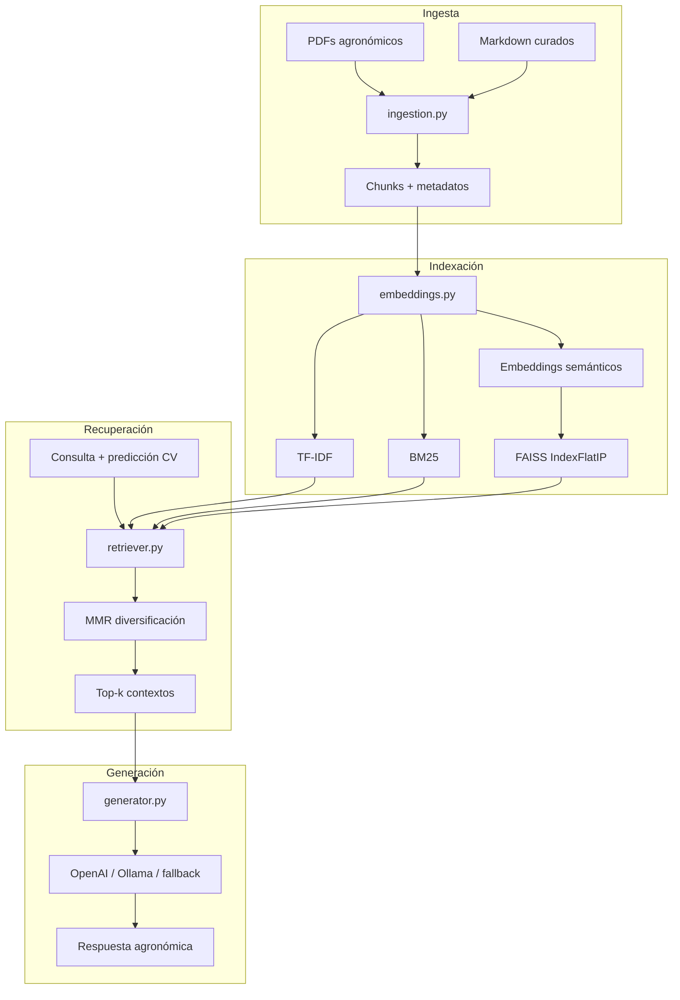

# Pipeline RAG — Sistema de Recuperación Aumentada por Generación

Módulo de recuperación documental y generación de respuestas para el agente agronómico de caña de azúcar (proyecto de grado).

## Arquitectura



## Componentes

| Módulo | Responsabilidad |
|--------|-----------------|
| `ingestion.py` | Carga y limpieza de PDFs/MD; chunking con solapamiento |
| `preprocessing.py` | Normalización de términos agronómicos, lematización ligera |
| `embeddings.py` | TF-IDF, BM25, semantic, hybrid (RRF) + FAISS |
| `retriever.py` | Búsqueda, expansión de consulta, MMR, boost por enfermedad |
| `generator.py` | Integración LLM con prompts agronómicos |
| `compare.py` | Comparación experimental entre métodos |
| `report.py` | Gráficos y tablas Markdown/LaTeX para la tesis |
| `eval_metrics.py` | Faithfulness, MRR, nDCG, ablación RAG |

## Dataset documental

- **Ubicación:** `src/app/knowledge_base/`
- **Contenido:** ~46 documentos (PDFs técnicos + Markdown curados por enfermedad)
- **Dominio:** Fitopatología de caña, MIP/MID, plagas, guías fitosanitarias

## Métricas de evaluación (oficiales)

| Métrica | Descripción | Rango |
|---------|-------------|-------|
| **Faithfulness** | Sustento de la respuesta en contextos recuperados | [0, 1] |
| **Answer Relevance** | Alineación pregunta-respuesta (léxica + semántica) | [0, 1] |
| **nDCG@5** | Ranking con relevancia **semántica** (embeddings) | [0, 1] |
| **Hallucination Rate** | 1 − Faithfulness | [0, 1] |

```bash
python src/scripts/eval_rag_ragas.py --skip-ragas
python src/scripts/experiments.py --methods semantic
```

**Retrieval por defecto:** `semantic` (embeddings + FAISS)

## Referencias

- Lewis, P. et al. (2020). Retrieval-Augmented Generation for Knowledge-Intensive NLP Tasks.
- Reimers, N. & Gurevych, I. (2019). Sentence-BERT: Sentence Embeddings using Siamese BERT-Networks.
- Robertson, S. & Zaragoza, H. (2009). The Probabilistic Relevance Framework: BM25 and Beyond.
